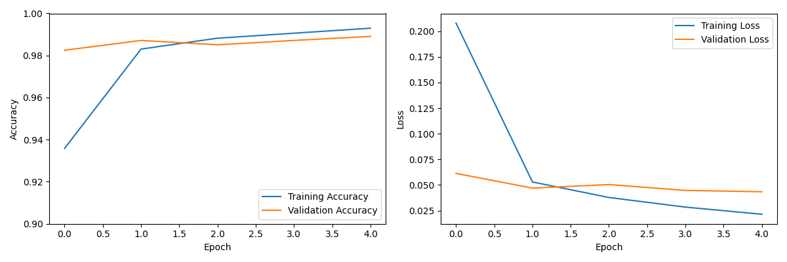
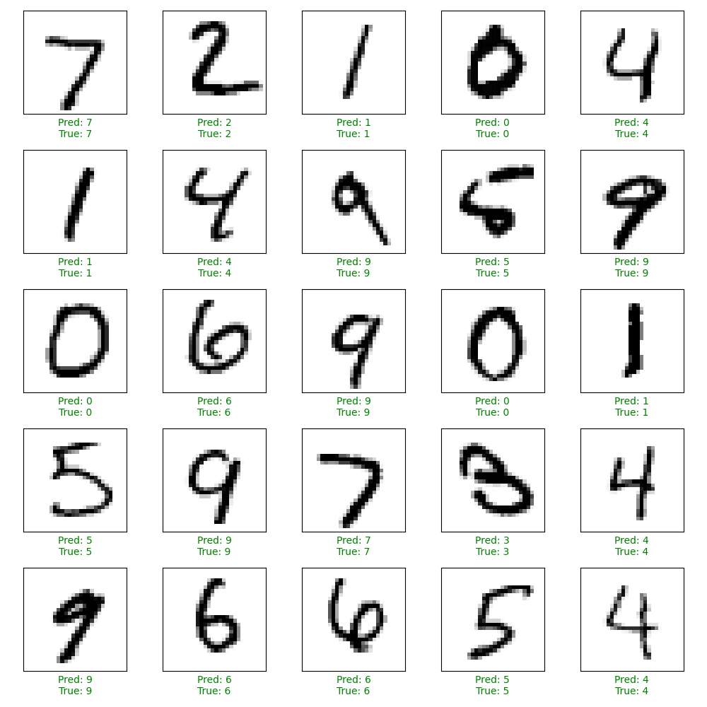

```markdown
# MNIST Handwritten Digit Recognition

A convolutional neural network (CNN) implementation for recognizing handwritten digits from the MNIST dataset, achieving over 99% accuracy.
The MNIST database is a dataset of handwritten digits containing 60,000 training samples, and 10 000 testing samples(digit images). Each image is (28x28) pixels, each containing an integer value 0 - 255 with its grayscale value.
## Project Structure

```
```
MNIST_handwritten_digit_recognition/
├── digit_recognizer.py       # Main Python script
├── train-images.idx3-ubyte   # Training images
├── train-labels.idx1-ubyte   # Training labels
├── t10k-images.idx3-ubyte    # Test images
├── t10k-labels.idx1-ubyte    # Test labels
├── requirements.txt          # Python dependencies
└── README.md                 # This file
```

## Requirements

- Python 3.6+
- TensorFlow 2.x
- NumPy
- Matplotlib

## Installation

1. Clone or download this repository
2. Navigate to the project directory:
   ```bash
   cd MNIST_handwritten_digit_recognition
   ```
3. Install the required packages:
   ```bash
   pip install -r requirements.txt
   ```

## Usage

Run the digit recognizer:
```bash
python digit_recognizer.py
```

The program will:
1. Load the MNIST dataset from the files
2. Create and train a CNN model
3. Evaluate the model on test data
4. Generate visualizations of:
   - Training history (accuracy and loss)
   - Sample predictions
5. Save the trained model as `mnist_model.keras`

## Expected Output

```
Loading MNIST dataset from current directory...

Creating model...
Model: "sequential"
_________________________________________________________________
Layer (type)                 Output Shape              Param #   
=================================================================
conv2d (Conv2D)              (None, 26, 26, 32)        320       
_________________________________________________________________
max_pooling2d (MaxPooling2D) (None, 13, 13, 32)        0         
_________________________________________________________________
conv2d_1 (Conv2D)            (None, 11, 11, 64)        18496     
_________________________________________________________________
max_pooling2d_1 (MaxPooling2 (None, 5, 5, 64)          0         
_________________________________________________________________
conv2d_2 (Conv2D)            (None, 3, 3, 64)          36928     
_________________________________________________________________
flatten (Flatten)            (None, 576)               0         
_________________________________________________________________
dense (Dense)                (None, 64)                36928     
_________________________________________________________________
dense_1 (Dense)              (None, 10)                650       
=================================================================
Total params: 93,322
Trainable params: 93,322
Non-trainable params: 0
_________________________________________________________________

Training model...
Epoch 1/5
750/750 [==============================] - 10s 13ms/step - loss: 0.1860 - accuracy: 0.9433 - val_loss: 0.0657 - val_accuracy: 0.9802
Epoch 2/5
750/750 [==============================] - 9s 12ms/step - loss: 0.0539 - accuracy: 0.9835 - val_loss: 0.0479 - val_accuracy: 0.9852
...
313/313 - 1s - loss: 0.0286 - accuracy: 0.9912

Test accuracy: 99.12%

Model saved as mnist_model.keras
Done!
```

## Generated Files

After running the program, you'll find these additional files:
- `mnist_model.keras` - Trained model weights
- `training_history.png` - Accuracy and loss plots
- `sample_predictions.png` - 25 test samples with predictions

  
*Figure 1: Training and validation accuracy/loss over epochs*

  
*Figure 2: Model predictions on test samples (green=correct, red=incorrect)*

## Customization

You can modify the following parameters in `digit_recognizer.py`:
- Number of training epochs (default: 5)
- Model architecture in `create_model()`
- Batch size in `train_model()`

## Troubleshooting

If you encounter any issues:
1. Verify all four MNIST data files are present
2. Ensure you have Python 3.6+ installed
3. Check TensorFlow installation with:
   ```bash
   python -c "import tensorflow as tf; print(tf.__version__)"
   ```

## License

This project is open source and available under the MIT License.
```

This README includes:
1. Clear project structure
2. Installation instructions
3. Usage guide
4. Expected output
5. Information about generated files
6. Customization options
7. Troubleshooting tips
8. License information

